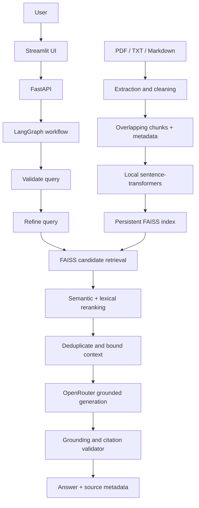

# DocuMind AI — Production RAG

DocuMind AI is the Advanced ShadowFox AI Engineer Internship project: a document-grounded question-answering application with a FastAPI backend, LangGraph retrieval workflow, local sentence-transformer embeddings, persistent FAISS index, and a Streamlit interface.

## Overview and features

Upload PDF, TXT, or Markdown documents, ask questions across the full library or a selected document, and inspect cited passages. The pipeline extracts text, cleans whitespace while preserving meaning, chunks it with overlap, embeds locally, retrieves and reranks candidates, limits context, generates an answer through an optional OpenRouter-compatible model, and deterministically checks evidence and citations before returning it.

### Why this is Advanced-level RAG

The application implements the complete ingestion and retrieval lifecycle, a two-stage retriever, explicit document scoping, typed API schemas, a real LangGraph state machine, persistence, and a post-generation grounding gate. RAG adds private, user-provided evidence to a language model request; it lets the system answer from current uploaded material without sending whole files or relying on a model's memory. Local embeddings and FAISS avoid paid embedding services and hosted vector databases.

## Architecture



### Project structure

```text
advanced/production-rag/
├── app/
│   ├── api/              # health, document, and query routes
│   ├── config/           # typed environment settings
│   ├── embeddings/       # lazy local sentence-transformers wrapper
│   ├── generation/       # OpenRouter client and grounded prompt
│   ├── grounding/         # deterministic citation/evidence gate
│   ├── ingestion/         # PDF, text, and Markdown extraction
│   ├── processing/        # conservative cleaning and chunking
│   ├── retrieval/         # FAISS candidate lookup, rerank, context filter
│   ├── schemas/           # Pydantic API models
│   ├── services/          # document lifecycle service
│   ├── vectorstore/       # FAISS index and JSON metadata persistence
│   └── workflow/          # typed LangGraph state and graph
├── frontend/streamlit_app.py
├── data/                  # ignored runtime index and uploads
├── tests/
├── Dockerfile
├── docker-compose.yml
└── requirements.txt
```

## Technology stack

Python 3.11, FastAPI, Streamlit, Pydantic Settings, LangGraph, FAISS CPU, sentence-transformers, pypdf, OpenAI-compatible OpenRouter API, pytest, and Docker Compose. Dependency versions are pinned in `requirements.txt` for reproducible Python 3.11 installs.

## Setup

### Python and virtual environment

Use Python 3.11. From this directory:

```powershell
py -3.11 -m venv .venv
.venv\Scripts\Activate.ps1
python -m pip install --upgrade pip
pip install -r requirements.txt
```

Copy `.env.example` to `.env`. Configure `OPENROUTER_API_KEY` to enable answer generation. Without it, upload and retrieval remain available and the API returns a clear configuration message rather than crashing. Never commit `.env`.

### Environment variables

| Variable | Default | Purpose |
|---|---|---|
| `OPENROUTER_API_KEY` | empty | Optional key for generated answers |
| `OPENROUTER_MODEL` | `openrouter/auto` | OpenRouter model slug |
| `OPENROUTER_BASE_URL` | OpenRouter URL | OpenAI-compatible endpoint |
| `EMBEDDING_MODEL` | `sentence-transformers/all-MiniLM-L6-v2` | Local embedding model |
| `CHUNK_SIZE` / `CHUNK_OVERLAP` | 800 / 150 | Character chunking controls |
| `TOP_K` / `RERANK_TOP_K` | 8 / 4 | Candidate and final passage limits |
| `SIMILARITY_THRESHOLD` | 0.12 | Semantic relevance floor |
| `MAX_CONTEXT_CHARS` | 9000 | Prompt context cap |
| `MAX_UPLOAD_BYTES` | 15000000 | Per-file upload cap |
| `DATA_DIR` | project `data/` | Persistent index storage root |

### OpenRouter setup

Create an OpenRouter API key and set it in `.env`. Choose a model available to your account in `OPENROUTER_MODEL`. Requests use the OpenAI-compatible chat completions interface, with a timeout and user-safe error handling. No paid provider is required by the application, but model availability and any provider pricing depend on the selected OpenRouter model.

### Local embeddings and FAISS

The first indexing or query operation lazily loads `all-MiniLM-L6-v2`; the model is cached for the process and runs locally. The model normalizes vectors. FAISS `IndexFlatIP` then performs exact inner-product search, equivalent to cosine similarity for normalized vectors. Metadata is persisted separately from vectors and maps each FAISS row to document name, type, page, chunk ID, and text. Documents can be deleted; the remaining vectors are compacted and the index is rebuilt.

### Ingestion and chunking

The loader validates extension, size, UTF-8 decoding, and extractable text. PDFs are extracted page by page with original page numbers. Text and Markdown retain their content and are referenced by chunk number. Preprocessing normalizes Unicode and whitespace without removing punctuation. Chunks use a configurable character window (800 default) and 150-character overlap; each chunk carries stable-in-session document and chunk identifiers plus its source text.

### Retrieval, reranking, and context

FAISS returns up to `TOP_K` semantic candidates, scoped to a selected document when requested. A local second-stage reranker calculates `0.72 × normalized semantic score + 0.28 × query-term coverage`, then drops weak matches and keeps at most `RERANK_TOP_K`. Context assembly removes exact duplicates, orders by reranked score, preserves citation metadata, and enforces the character budget. The workflow lightly normalizes whitespace in the retrieval query while generation retains the user's original question; this refinement is deliberately deterministic and cannot fail due to an unavailable LLM.

### LangGraph and grounded generation

LangGraph carries a typed state through query validation, query refinement, retrieval, reranking, context assembly, generation, and grounding validation. The generation prompt allows only the provided excerpts, asks the model to abstain when evidence is missing, and directs citations to the supplied source labels. The deterministic validator requires valid inline source citations and checks meaningful lexical overlap between answer sentences and retrieved evidence. Unsupported output is replaced by a safe abstention. This is a conservative heuristic rather than a semantic entailment model; it reduces unsupported claims but is not a formal guarantee of truth.

Each source citation is built from actual chunk metadata. PDF references include extracted page numbers; TXT/Markdown sources identify the chunk. The UI exposes document, page/chunk, score, and passage text.

## Run locally

Start the backend from this directory:

```powershell
uvicorn app.main:app --reload --port 8000
```

In a second terminal, activate the same environment and run:

```powershell
$env:API_URL = "http://localhost:8000"
streamlit run frontend/streamlit_app.py --server.port 8501
```

Open `http://localhost:8501`. The API docs are at `http://localhost:8000/docs`.

## FastAPI endpoints

| Method | Path | Description |
|---|---|---|
| GET | `/health` | Liveness check |
| POST | `/documents/upload` | Multipart PDF/TXT/Markdown ingestion (201) |
| GET | `/documents` | List indexed documents |
| DELETE | `/documents/{document_id}` | Remove metadata and vectors |
| POST | `/query` | Grounded question; optional `document_id` scope |

Pydantic validates request bodies. Invalid questions receive 422, unsupported uploads 400, unknown document IDs 404, and unavailable workflow/model requests return safe errors. Health is available even when no model key is configured.

## Streamlit usage

The dark indigo UI guides the user through upload, indexing, library management, scope selection, question entry, answer inspection, and source review. Technical retrieval details are collapsed into an expander. The interface handles an unavailable backend, empty library, invalid upload, empty question, failed indexing, missing model setup, and insufficient evidence with readable messages.

## Docker

With Docker Desktop running, configure `.env` if answer generation is desired and run:

```bash
docker compose up --build
```

The UI is on port 8501 and the API on port 8000. Compose shares persistent named volumes for the FAISS data and downloaded embedding model; the frontend reaches the backend using the internal `api` service name. Without a key, the app starts and clearly reports generation configuration issues.

## Testing

Run from this directory:

```bash
pytest -q
python -m compileall app frontend tests
```

Tests use deterministic local embeddings and a fake LLM. They require no OpenRouter key or network model download and use temporary index directories. Coverage includes loader behavior, cleaning, chunk overlap and metadata, real FAISS indexing/search/scope/delete, reranking, context, grounding/abstention, LangGraph end-to-end flow, API health, schemas, and upload errors.

## Example

Upload a document containing “The Eiffel Tower is located in Paris. It was completed in 1889.” Ask “Where is the Eiffel Tower located?” DocuMind retrieves the supporting chunk and returns a cited response such as “The Eiffel Tower is located in Paris [Source 1].” A question about information absent from the document should be refused by the grounding gate.

## Limitations

- Scanned PDFs without an embedded text layer need OCR, which is not included.
- The deterministic lexical grounding check is a useful guardrail, not a proof of entailment.
- The document catalog is reconstructed from indexed chunk metadata; upload timestamps are process-local and show a generic restored label after restart.
- Local embedding inference needs disk space, memory, and an initial model download. Docker image installation is substantial because of PyTorch and sentence-transformers.
- OpenRouter generation needs a valid configured provider key/model. FAISS `IndexFlatIP` is exact and suitable for a compact single-user demo, not a distributed multi-tenant service.

## Future improvements

Add OCR for scanned documents, durable transactional document metadata, stronger claim-level entailment checks, authentication and per-user isolation, background indexing jobs, hybrid sparse retrieval, and a scalable approximate-nearest-neighbor index for larger libraries.
